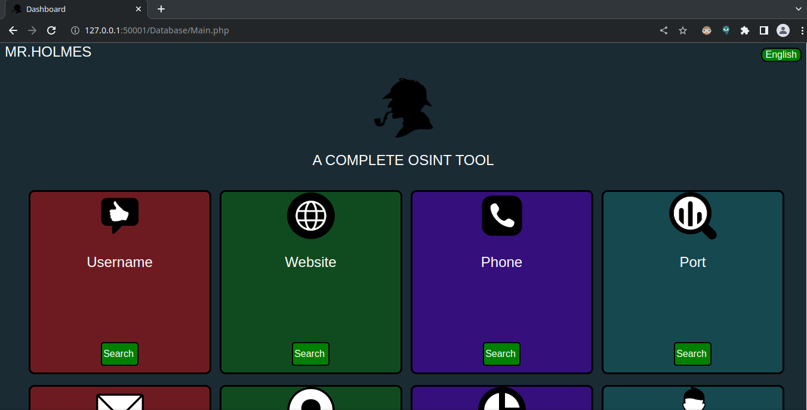
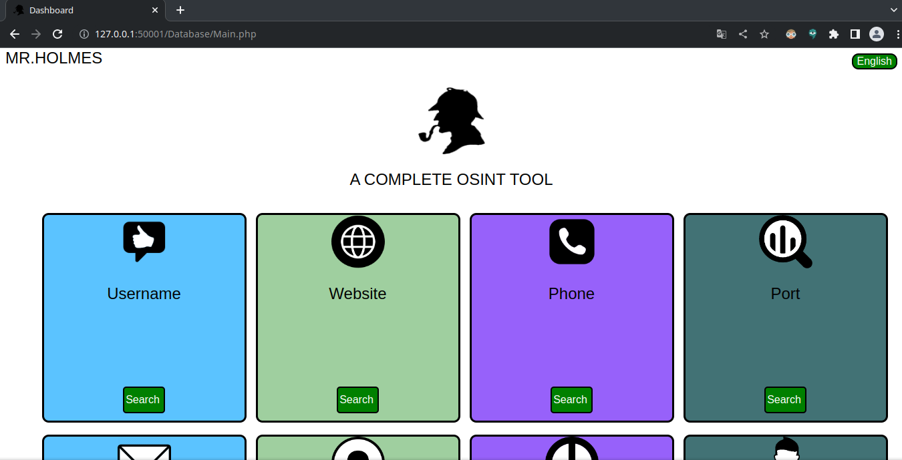
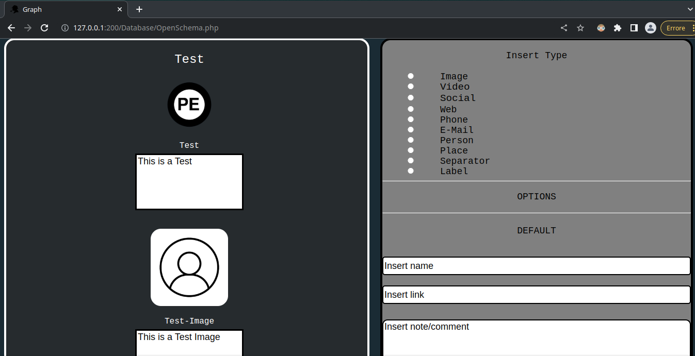
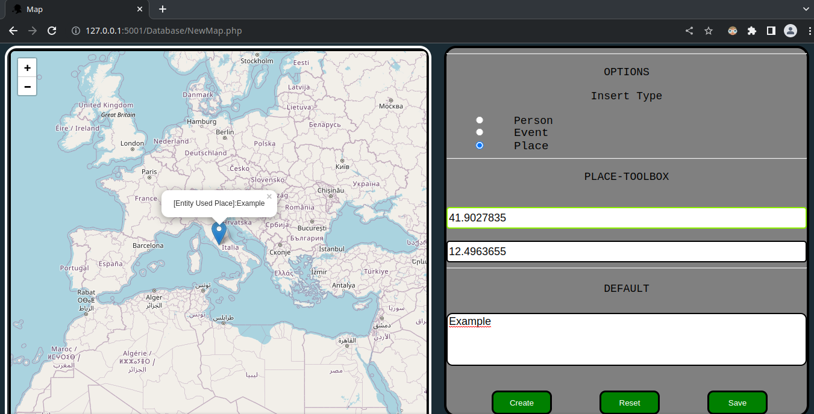
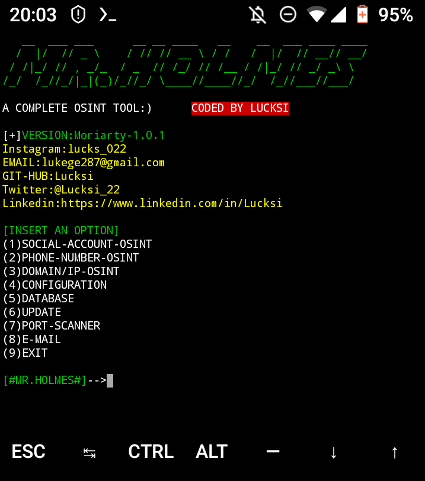
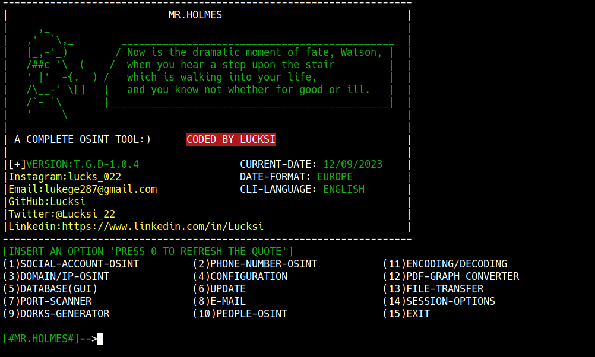
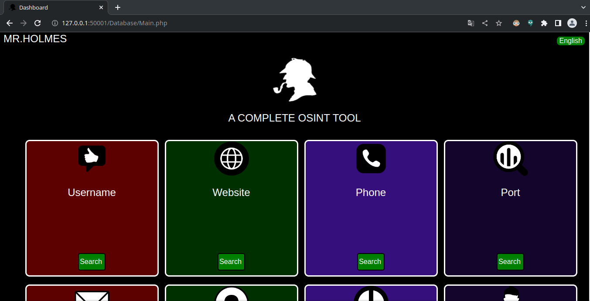
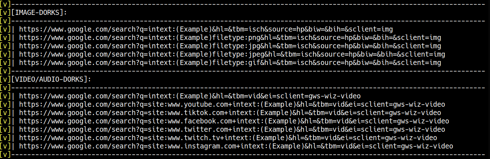
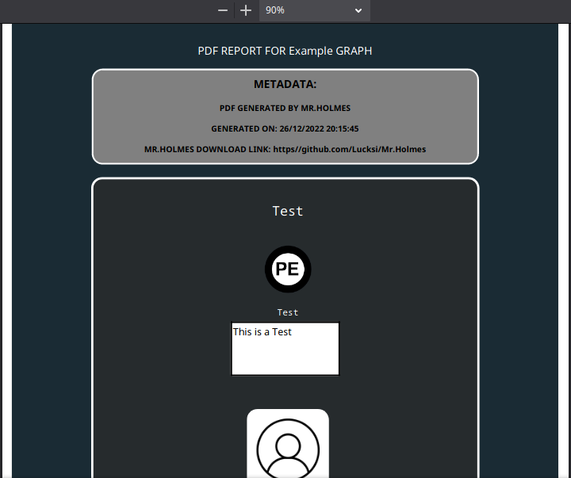
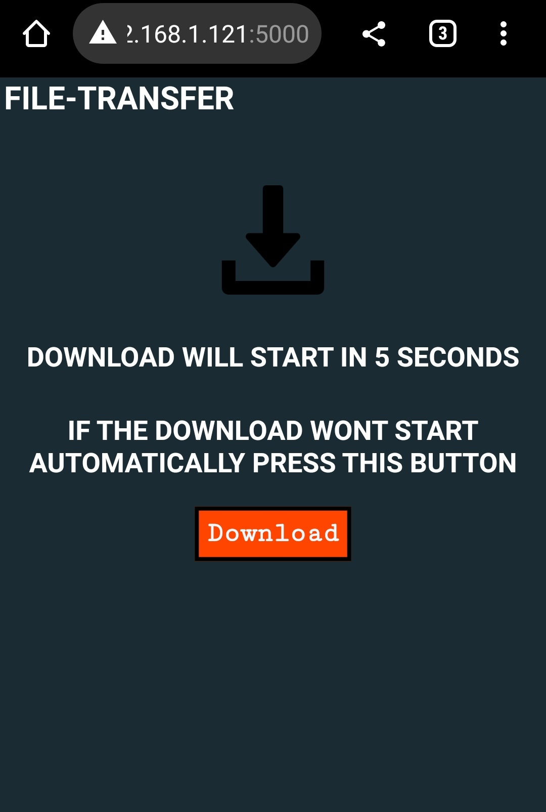

<div align="center">

# 🔍 Mr.Holmes - Fixed Edition


[](https://git.io/typing-svg)

<p align="center">
  
  
  
  
  
</p>

<p align="center">
  <a href="#-features">Features</a> •
  <a href="#-installation">Installation</a> •
  <a href="#-usage">Usage</a> •
  <a href="#-screenshots">Screenshots</a> •
  <a href="#-credits">Credits</a>
</p>

</div>

---

## 📋 About

**Mr.Holmes** is a comprehensive **OSINT (Open-Source Intelligence)** gathering tool designed for information security professionals, researchers, and enthusiasts. This **fixed and patched version** includes critical bug fixes and improvements for enhanced stability and reliability.

### 🎯 What It Does

- 🔎 **Username OSINT** - Track usernames across multiple social media platforms
- 📱 **Phone Number Lookup** - Gather intelligence on phone numbers
- 🌐 **Domain/IP Investigation** - Detailed domain and IP reconnaissance  
- 📧 **Email Analysis** - Email validation and social media correlation
- 👤 **People Search** - Comprehensive person information gathering
- 🔓 **Port Scanning** - Network security assessment
- 🔍 **Google Dorks** - Advanced search queries for targeted research
- 🗺️ **Interactive Mapping** - Geolocation visualization
- 📊 **PDF Reports** - Generate professional investigation reports

---

## ✨ What's New in This Fixed Version

<div align="center">

| 🐛 Bug Fixes | 🚀 Improvements |
|:------------|:----------------|
| ✅ Fixed `FileExistsError` crashes | ✅ Enhanced error handling |
| ✅ Fixed `KeyError: 'Settings'` issues | ✅ Improved stability |
| ✅ Replaced deprecated `os.mkdir()` calls | ✅ Better dependency management |
| ✅ Added missing configuration files | ✅ Updated documentation |

</div>

---

## 🚀 Installation

### 🐧 Linux / macOS (Recommended - Virtual Environment)

```bash
# Clone the repository
git clone https://github.com/pythonplayer396/Mr.Holmes
cd Mr.Holmes

# Create and activate virtual environment
python3 -m venv vevn
source vevn/bin/activate

# Install dependencies
pip3 install -r requirements.txt

# Run the tool
python3 MrHolmes.py
```

### 🐧 Linux / macOS (Standard Installation)

```bash
git clone https://github.com/pythonplayer396/Mr.Holmes
cd Mr.Holmes
sudo apt-get update
sudo chmod +x install.sh
sudo bash install.sh
```

### 🪟 Windows

```cmd
git clone https://github.com/pythonplayer396/Mr.Holmes
cd Mr.Holmes
Install.cmd
```

### 📱 Termux (Android)

```bash
pkg install proot
git clone https://github.com/pythonplayer396/Mr.Holmes
cd Mr.Holmes
proot -0 chmod +x install_Termux.sh
./install_Termux.sh
```

---

## 🎮 Usage

### Quick Start

```bash
cd Mr.Holmes
source vevn/bin/activate  # If using virtual environment
python3 MrHolmes.py
```

### Main Menu Options

```
(1)  SOCIAL-ACCOUNT-OSINT    →  Track usernames across platforms
(2)  PHONE-NUMBER-OSINT      →  Phone number intelligence
(3)  DOMAIN/IP-OSINT         →  Domain and IP investigation
(4)  CONFIGURATION           →  Tool settings
(5)  DATABASE (GUI)          →  Web-based database interface
(6)  UPDATE                  →  Check for updates
(7)  PORT-SCANNER            →  Network port scanning
(8)  E-MAIL                  →  Email investigation
(9)  DORKS-GENERATOR         →  Google dorks for research
(10) PEOPLE-OSINT            →  Person information gathering
(11) ENCODING/DECODING       →  Report encryption
(12) PDF-GRAPH CONVERTER     →  Generate visual reports
(13) FILE-TRANSFER           →  QR code file transfer
(14) SESSION-OPTIONS         →  Session management
(15) EXIT                    →  Exit the program
```

---

## 🎨 Features Showcase

<div align="center">

### 🌗 Theme Support




### 📊 Reporting & Visualization




### 📱 Mobile Friendly



</div>

---

## ⚙️ Configuration

### 🔧 Configuration File

Edit `Configuration/Configuration.ini` to customize settings:

```ini
[Settings]
password = Holmes
api_key = None
proxy_list = Proxies/Proxy_list.txt
useragent_list = Useragents/Useragent.txt
show_logs = False
database = False
language = english
date_format = eu
```

### 🎨 GUI Theme Configuration

```json
// GUI/Theme/Mode.json
{
    "Color": {
        "Background": "Light"  // Options: Light, Dark, High-Contrast
    }
}
```

### 🌐 Language Support

Available languages:
- 🇬🇧 English
- 🇮🇹 Italiano  
- 🇫🇷 Français

---

## 📸 Screenshots

<details>
<summary><b>🖼️ Click to view all screenshots</b></summary>

### Main Interface


### Dark Mode


### Light Mode  


### High Contrast Mode


### Google Dorks


### PDF Export


### File Transfer


</details>

---

## ⚠️ Disclaimer

> **IMPORTANT:** This tool is intended for **educational and research purposes only**. The accuracy of results may vary. Users are solely responsible for ensuring their usage complies with applicable laws and regulations. The developer assumes no liability for misuse or any damages caused by this software.

---

## 🔑 API Configuration

For enhanced domain lookups, obtain a free API key from:
- [WHOIS XML API](https://whois.whoisxmlapi.com)

Add your API key to `Configuration/Configuration.ini`

---

## 📦 Requirements

- **Python:** 3.x or higher
- **Operating Systems:** Linux, macOS, Windows, Termux (Android)
- **Dependencies:** Listed in `requirements.txt`
- **Optional:** wkhtmltopdf (for PDF generation)

---

## 🤝 Credits & Attribution

<div align="center">

### 🛠️ Fixed & Maintained By

**darkwall**

[](https://instagram.com/darkwall0901)
[](https://github.com/pythonplayer396)

---

### 📜 License

**GPL-3.0 License**

```
Copyright (C) 2025 darkwall
Fixes & Patches by darkwall

This program is free software: you can redistribute it and/or modify
it under the terms of the GNU General Public License as published by
the Free Software Foundation, either version 3 of the License, or
(at your option) any later version.
```

---

### 💝 Acknowledgments

- Original concept and base code structure
- Icons from [IconFinder](https://www.iconfinder.com/)
- Interactive maps powered by [Leaflet](https://leafletjs.com)
- Community contributors and testers

</div>

---

<div align="center">

### ⭐ Star this repo if you found it useful!


**[↑ Back to Top](#-mrholmes---fixed-edition)**

</div>
